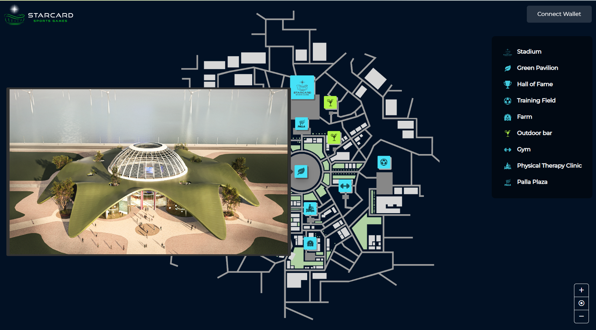
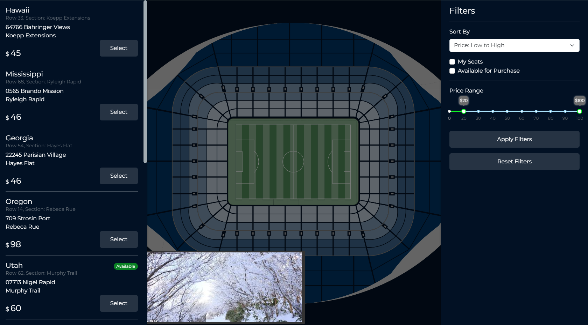
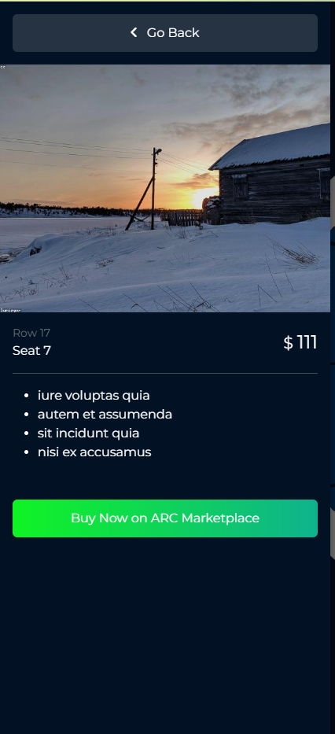
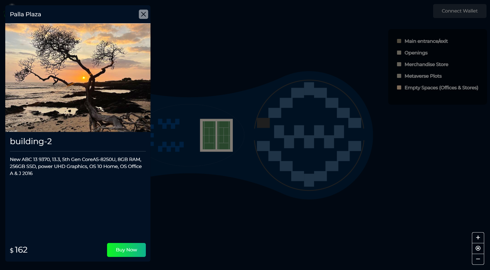
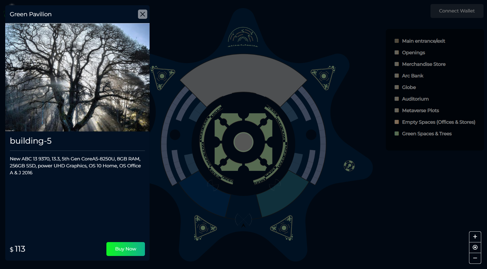

## Metaverse Plots buying & selling

### Introduction

The blockchain technology has brought significant innovation in the world of digital assets, and NFTs (Non-Fungible
Tokens) have emerged as a new asset class in the decentralized ecosystem. In this project, we aim to utilize blockchain
technology to enable buying and selling of Metaverse plots as NFTs. The Metaverse is a virtual space where users can
create and interact with different digital assets, and plots are the basic building blocks of the Metaverse. With the
use of smart contracts and decentralized platforms, we have created a secure and transparent marketplace where users can
easily connect their MetaMask wallets to purchase and sell Metaverse plots as NFTs. Furthermore, we have implemented the
use of maps to provide a visual representation of the available plots and their respective locations, making it easier
for users to navigate and select their preferred plots.<br> <br>
Traditional ticketing systems often face challenges related to fraud, counterfeit tickets, and high transaction fees.
Blockchain-based ticketing systems provide a secure and transparent alternative, enabling users to buy, sell, and
transfer tickets without intermediaries. This project aims to utilize blockchain technology to develop a ticketing
system that provides a secure and transparent way for users to purchase and transfer tickets.
<h3 align="center"></h3>

### Features

<ol>
<li>Maps Integration</li>
<li>Connect wallet</li>
<li>ZoomIn/ZoomOut on maps</li>
<li>Placeholders to view location</li>
<li>Filters for desired search</li>
<li>Detail of section before buy</li>
</ol>

### Main Technologies/Libraries Used
<ul>
<li>React.js</li>
<li>Web3</li>
<li>bootstrap</li>
<li>reactstrap</li>
<li>hover.css</li>
<li>rc-slider</li>
<li>react-image-marker</li>
<li>react-minimap</li>
<li>react-zoom-pan-pinch</li>
</ul>

## Available Scripts

In the project directory, you can run:

### `npm start`

Runs the app in the development mode.<br />
Open [http://localhost:3000](http://localhost:3000) to view it in the browser.

The page will reload if you make edits.<br />
You will also see any lint errors in the console.

### `npm test`

Launches the test runner in the interactive watch mode.<br />
See the section about [running tests](https://facebook.github.io/create-react-app/docs/running-tests) for more
information for test.

### `npm run build`

Builds the app for production to the `build` folder.<br />
It correctly bundles React in production mode and optimizes the build for the best performance.

The build is minified and the filenames include the hashes.<br />
Your app is ready to be deployed!

See the section about [deployment](https://facebook.github.io/create-react-app/docs/deployment) for more information.

### 🗄️ Project Structure

Most of the code lives in the `src` folder and looks like this:
````
.
├── public
├── src/
│   ├── assets/
│   │   ├── css
│   │   ├── icons
│   │   └── images
│   ├── components/
│   │   ├── stadium-sidebar/
│   │   │   ├── detailSidebar.jsx
│   │   │   ├── filterSidebar.jsx
│   │   │   └── sectionDetails.jsx
│   │   ├── GreenPavilion.jsx
│   │   ├── MainMap.jsx
│   │   ├── PallaPlaza.jsx
│   │   └── Stadium.jsx
│   ├── config/
│   │   └── constanst.json
│   ├── utils/
│   │   └── httpService.js
│   ├── App.js
│   ├── index.js
│   └── routes.js
├── .gitignore
├── package.json
└── Readme.md
````
### Screenshots




